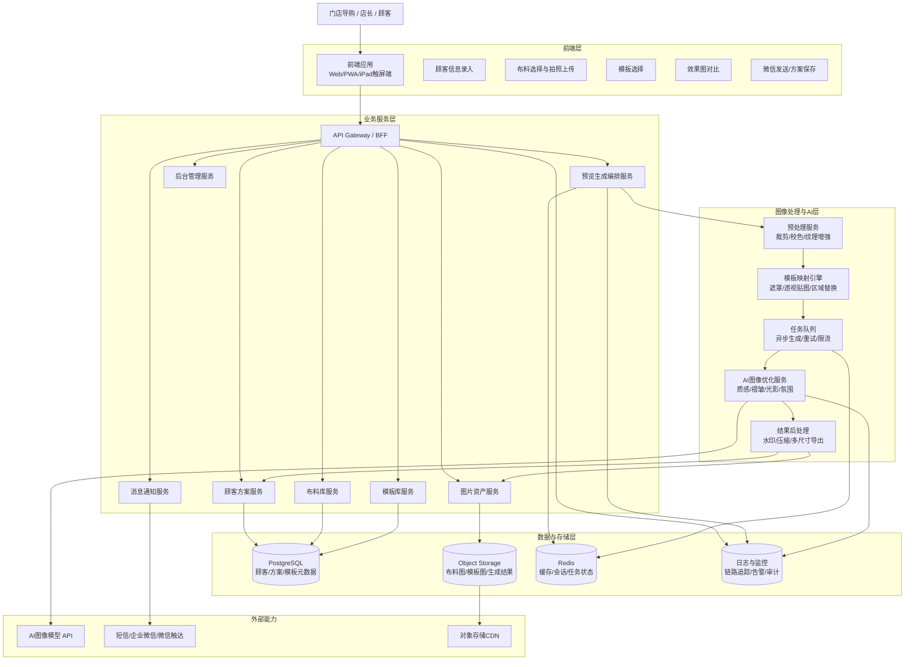
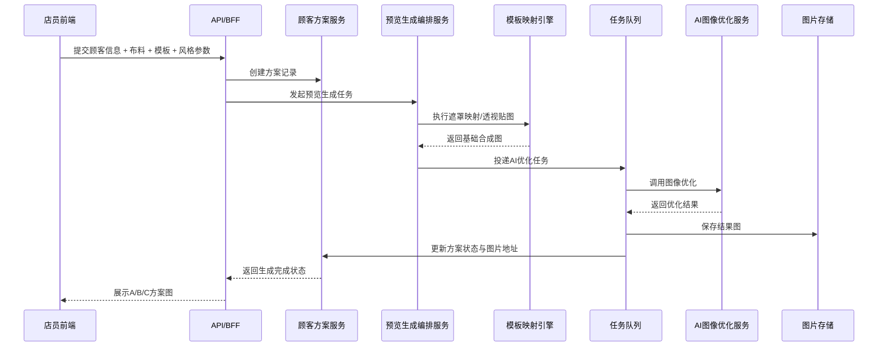
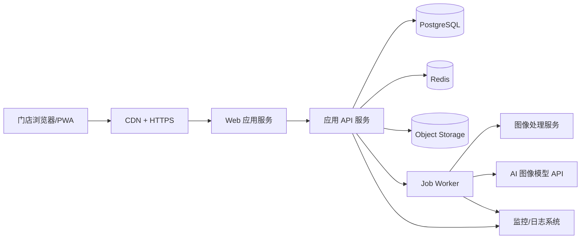

# 门店实时选布成品预览系统 技术架构图

## 1. 架构目标

本系统的技术架构需要同时满足以下要求：

- 支持门店现场快速操作
- 支持 5-30 秒内完成预览图生成
- 支持布料库、模板库、顾客方案的持续沉淀
- 支持后续从 MVP 扩展到真实卧室换装和报价联动
- 保证图像生成链路可监控、可追踪、可降级

## 2. 总体技术架构图

## 3. 核心生成链路

## 4. 分层说明

### 4.1 前端层

建议采用 `Next.js Web 应用` 或 `React PWA`：

- 兼容 iPad、触屏一体机、门店电脑
- 无需安装复杂客户端
- 后续方便扩展后台管理端

前端模块建议：

- 顾客接待页
- 布料选择页
- 拍照上传页
- 模板选择页
- 生成结果页
- 历史方案页
- 后台素材管理页

### 4.2 API Gateway / BFF

职责：

- 统一前端接口
- 聚合多个后端服务结果
- 做参数校验和权限控制
- 屏蔽内部服务拆分细节

建议：

- Node.js + NestJS
- 或 Next.js Route Handlers 先做 MVP

如果第一阶段团队小，BFF 和业务服务可以先合并部署。

### 4.3 业务服务层

建议拆成以下模块：

- `顾客方案服务`
  - 管理顾客信息、婚期、床尺寸、偏好、生成历史
- `布料库服务`
  - 管理布料素材、标签、颜色、材质、价格带
- `模板库服务`
  - 管理床型模板、婚庆模板、遮罩和映射参数
- `预览生成编排服务`
  - 串联图像预处理、映射、AI 优化、状态回写
- `图片资产服务`
  - 统一上传、签名访问、缩略图、导出图
- `消息通知服务`
  - 微信发送、短信提醒、导购回访

### 4.4 图像处理与 AI 层

这是系统的核心壁垒，建议拆成两段：

1. `确定性图像处理`
- 布料裁剪
- 色彩校正
- 遮罩映射
- 透视贴图
- 纹理平铺

2. `生成式优化`
- 褶皱质感增强
- 光影统一
- 场景氛围增强
- 婚庆风格强化

这样做的原因：

- 纯 AI 生成不稳定
- 纯模板贴图不够高级
- 混合方案最适合门店成交场景

### 4.5 数据与存储层

建议组合：

- `PostgreSQL`
  - 顾客信息
  - 方案记录
  - 布料元数据
  - 模板元数据
  - 生成任务记录

- `Object Storage`
  - 布料原图
  - 模板原图
  - 遮罩图
  - 生成结果图

- `Redis`
  - 任务状态缓存
  - 热门模板缓存
  - 会话数据
  - 并发控制

## 5. 推荐部署架构

MVP 推荐部署方式：

- 前端：Vercel / 静态托管
- API：Node.js 服务
- 数据库：PostgreSQL
- 缓存队列：Redis
- 文件存储：S3 兼容对象存储
- Worker：独立后台任务服务

这样有几个好处：

- Web 和 AI 生成任务解耦
- 前端不会因为生成阻塞
- 后续可单独扩容 Worker

## 6. 核心数据模型

### 6.1 顾客方案

- `customer_id`
- `name`
- `phone`
- `wedding_date`
- `bed_size`
- `style_preference`
- `budget_range`
- `selected_fabrics`
- `selected_template`
- `generated_images`
- `status`

### 6.2 布料素材

- `fabric_id`
- `fabric_code`
- `name`
- `category`
- `color_family`
- `material`
- `wedding_tag`
- `texture_images`
- `price_level`
- `enabled`

### 6.3 模板素材

- `template_id`
- `template_name`
- `scene_type`
- `bed_size`
- `style`
- `base_image_url`
- `mask_image_url`
- `mapping_config`

### 6.4 生成任务

- `job_id`
- `plan_id`
- `input_fabric_id`
- `input_template_id`
- `prompt_params`
- `status`
- `result_urls`
- `error_message`
- `duration_ms`

## 7. 关键非功能设计

### 7.1 性能

- 热门模板预加载
- 热门布料预生成样图
- 图像链路异步化
- 结果轮询或 WebSocket 推送

### 7.2 稳定性

- 生成任务超时控制
- AI 调用失败自动重试
- 降级返回基础贴图结果
- 单任务状态可追踪

### 7.3 可维护性

- 模板、布料、顾客方案解耦
- 图像处理和业务逻辑解耦
- 外部 AI 模型可替换

### 7.4 安全与合规

- 顾客手机号脱敏展示
- 上传素材访问权限控制
- 操作日志留痕
- 图片结果设置时效签名链接

## 8. MVP 与后续演进

### 8.1 MVP 架构

第一阶段可以采用“单体应用 + 独立 Worker”：

- 一个 Web/API 应用
- 一个任务 Worker
- 一个 PostgreSQL
- 一个 Redis
- 一个对象存储
- 一个外部 AI 图像模型接口

这是最省成本且足够实用的方案。

### 8.2 二期演进

后续可增加：

- 真实卧室上传与换装服务
- 报价推荐服务
- 微信小程序顾客自助预览
- 推荐引擎
- 会员 CRM
- 数据分析看板

## 9. 技术选型建议

### 前端

- `Next.js`
- `TypeScript`
- `Tailwind CSS`
- `shadcn/ui`

### 后端

- `NestJS` 或 `Next.js Route Handlers`
- `Prisma`
- `PostgreSQL`
- `Redis`

### 图像与任务

- `Sharp` 或 `OpenCV`
- `BullMQ` 任务队列
- 独立 Worker 服务

### AI 接入

- 图像生成/编辑 API
- 可替换模型供应商接口层

## 10. 架构结论

这套系统最合理的技术路线不是“一个前端直接调 AI 出图”，而是：

`前端门店操作台 + 后端业务服务 + 图像处理流水线 + AI 优化服务 + 数据沉淀系统`

其中真正决定成败的是 3 件事：

- 模板与布料数字化质量
- 任务链路是否稳定
- 生成结果是否足够帮助成交

如果目标是先做可落地 MVP，这份架构已经足够支撑一期开发。
