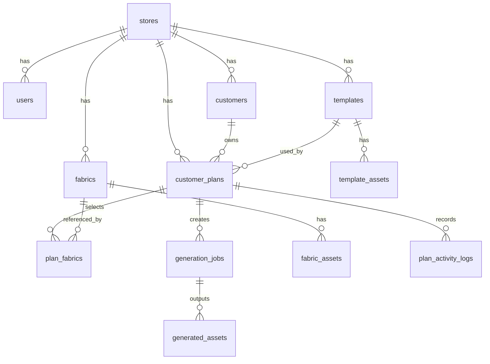

# 门店实时选布成品预览系统 数据库设计

## 1. 设计目标

本数据库设计服务于一期 MVP，目标是：

- 支持顾客方案创建、查询、留存
- 支持布料库和模板库管理
- 支持图片生成任务跟踪
- 支持结果图存储引用
- 为二期报价、会员、微信触达预留扩展空间

数据库建议使用 `PostgreSQL 16+`。

## 2. 设计原则

- 核心业务数据结构化存储
- 大文件只存 URL 和元数据，不存二进制
- 生成链路全程可追踪
- 优先满足门店演示和管理需要
- 先做单门店模型，再预留多门店字段

## 3. ER 图



## 4. 核心表清单

### 4.1 门店表 `stores`

用于后续支持多门店。

| 字段 | 类型 | 说明 |
| --- | --- | --- |
| id | uuid pk | 门店 ID |
| name | varchar(100) | 门店名称 |
| code | varchar(50) unique | 门店编码 |
| city | varchar(50) | 城市 |
| status | varchar(20) | `active/inactive` |
| created_at | timestamptz | 创建时间 |
| updated_at | timestamptz | 更新时间 |

### 4.2 用户表 `users`

门店店员、店长、管理员。

| 字段 | 类型 | 说明 |
| --- | --- | --- |
| id | uuid pk | 用户 ID |
| store_id | uuid fk | 所属门店 |
| name | varchar(50) | 姓名 |
| phone | varchar(20) | 手机号 |
| role | varchar(20) | `admin/manager/clerk` |
| password_hash | varchar(255) | 登录密码哈希 |
| status | varchar(20) | `active/inactive` |
| last_login_at | timestamptz | 最后登录时间 |
| created_at | timestamptz | 创建时间 |
| updated_at | timestamptz | 更新时间 |

### 4.3 顾客表 `customers`

顾客主档。

| 字段 | 类型 | 说明 |
| --- | --- | --- |
| id | uuid pk | 顾客 ID |
| store_id | uuid fk | 门店 ID |
| name | varchar(50) | 顾客姓名 |
| phone | varchar(20) | 联系方式 |
| wedding_date | date null | 婚期 |
| bed_size | varchar(20) null | 床尺寸 |
| style_preference | varchar(50) null | 风格偏好 |
| budget_range | varchar(50) null | 预算区间 |
| source_channel | varchar(30) null | 来源渠道 |
| notes | text null | 备注 |
| created_by | uuid fk | 创建店员 |
| created_at | timestamptz | 创建时间 |
| updated_at | timestamptz | 更新时间 |

约束建议：

- `(store_id, phone)` 建唯一索引，避免重复建档

### 4.4 布料表 `fabrics`

布料主数据。

| 字段 | 类型 | 说明 |
| --- | --- | --- |
| id | uuid pk | 布料 ID |
| store_id | uuid fk | 门店 ID |
| fabric_code | varchar(50) unique | 布料编码 |
| name | varchar(100) | 布料名称 |
| category | varchar(50) | 大类 |
| material | varchar(50) | 材质 |
| color_family | varchar(30) | 色系 |
| pattern_type | varchar(30) null | 花型类型 |
| wedding_tag | boolean | 是否婚庆主推 |
| price_level | varchar(20) | `basic/premium/luxury` |
| texture_complexity | varchar(20) null | 工艺复杂度 |
| description | text null | 描述 |
| status | varchar(20) | `active/inactive` |
| created_at | timestamptz | 创建时间 |
| updated_at | timestamptz | 更新时间 |

### 4.5 布料素材表 `fabric_assets`

布料原图、采样图、裁剪图。

| 字段 | 类型 | 说明 |
| --- | --- | --- |
| id | uuid pk | 素材 ID |
| fabric_id | uuid fk | 布料 ID |
| asset_type | varchar(30) | `raw/sample/cropped/thumbnail` |
| file_url | text | 文件地址 |
| width | integer null | 宽 |
| height | integer null | 高 |
| dominant_color | varchar(20) null | 主色 |
| capture_angle | varchar(20) null | 拍摄角度 |
| sort_order | integer | 排序 |
| created_at | timestamptz | 创建时间 |

### 4.6 模板表 `templates`

床品模板主数据。

| 字段 | 类型 | 说明 |
| --- | --- | --- |
| id | uuid pk | 模板 ID |
| store_id | uuid fk | 门店 ID |
| template_code | varchar(50) unique | 模板编码 |
| name | varchar(100) | 模板名称 |
| product_type | varchar(30) | `wedding_bedding/luxury_bedding` |
| scene_type | varchar(30) | `front/side/atmosphere` |
| bed_size | varchar(20) | 床型 |
| style | varchar(30) | 风格 |
| status | varchar(20) | `active/inactive` |
| version | integer | 版本号 |
| mapping_config | jsonb | 贴图配置 |
| prompt_preset | jsonb null | AI 优化预设 |
| created_at | timestamptz | 创建时间 |
| updated_at | timestamptz | 更新时间 |

### 4.7 模板素材表 `template_assets`

模板底图、遮罩图、预览图。

| 字段 | 类型 | 说明 |
| --- | --- | --- |
| id | uuid pk | 素材 ID |
| template_id | uuid fk | 模板 ID |
| asset_type | varchar(30) | `base/mask/preview/depth` |
| file_url | text | 文件地址 |
| width | integer null | 宽 |
| height | integer null | 高 |
| sort_order | integer | 排序 |
| created_at | timestamptz | 创建时间 |

### 4.8 顾客方案表 `customer_plans`

一次到店选布过程对应一个方案。

| 字段 | 类型 | 说明 |
| --- | --- | --- |
| id | uuid pk | 方案 ID |
| store_id | uuid fk | 门店 ID |
| customer_id | uuid fk | 顾客 ID |
| created_by | uuid fk | 创建店员 |
| plan_name | varchar(100) null | 方案名称 |
| product_type | varchar(30) | 产品类型 |
| selected_template_id | uuid fk null | 当前主模板 |
| preferred_style | varchar(30) null | 方案风格 |
| status | varchar(20) | `draft/generating/completed/archived` |
| favorite_option | varchar(10) null | 顾客收藏结果，如 `A/B/C` |
| notes | text null | 店员备注 |
| created_at | timestamptz | 创建时间 |
| updated_at | timestamptz | 更新时间 |

### 4.9 方案布料关联表 `plan_fabrics`

记录顾客对哪些布料做过试算。

| 字段 | 类型 | 说明 |
| --- | --- | --- |
| id | uuid pk | 关联 ID |
| plan_id | uuid fk | 方案 ID |
| fabric_id | uuid fk | 布料 ID |
| is_primary | boolean | 是否主选布料 |
| sort_order | integer | 顺序 |
| created_at | timestamptz | 创建时间 |

### 4.10 生成任务表 `generation_jobs`

整个出图链路的核心任务表。

| 字段 | 类型 | 说明 |
| --- | --- | --- |
| id | uuid pk | 任务 ID |
| store_id | uuid fk | 门店 ID |
| plan_id | uuid fk | 方案 ID |
| template_id | uuid fk | 模板 ID |
| fabric_id | uuid fk | 主布料 ID |
| trigger_source | varchar(20) | `manual/regenerate/compare` |
| input_payload | jsonb | 输入参数快照 |
| prompt_payload | jsonb null | AI 调参快照 |
| status | varchar(20) | `queued/processing/succeeded/failed/cancelled` |
| stage | varchar(30) null | 当前阶段 |
| error_code | varchar(50) null | 错误码 |
| error_message | text null | 错误详情 |
| duration_ms | integer null | 耗时 |
| started_at | timestamptz null | 开始时间 |
| finished_at | timestamptz null | 完成时间 |
| created_at | timestamptz | 创建时间 |

### 4.11 生成结果表 `generated_assets`

一次任务可能输出多张图。

| 字段 | 类型 | 说明 |
| --- | --- | --- |
| id | uuid pk | 结果 ID |
| job_id | uuid fk | 任务 ID |
| plan_id | uuid fk | 方案 ID |
| asset_role | varchar(20) | `A/B/C/base/final/share` |
| file_url | text | 文件地址 |
| thumbnail_url | text null | 缩略图地址 |
| width | integer null | 宽 |
| height | integer null | 高 |
| file_size | integer null | 文件大小 |
| is_favorite | boolean | 是否被顾客选中 |
| created_at | timestamptz | 创建时间 |

### 4.12 方案操作日志表 `plan_activity_logs`

用于回溯和分析店员操作。

| 字段 | 类型 | 说明 |
| --- | --- | --- |
| id | uuid pk | 日志 ID |
| plan_id | uuid fk | 方案 ID |
| operator_id | uuid fk | 操作人 |
| action_type | varchar(30) | 如 `create_plan/select_fabric/generate/send_wechat` |
| action_payload | jsonb null | 扩展参数 |
| created_at | timestamptz | 创建时间 |

## 5. 推荐枚举

建议不要一开始做 PostgreSQL enum，优先用 `varchar + 应用层约束`，后续更好改。

关键取值建议：

- `status`
  - 顾客方案：`draft/generating/completed/archived`
  - 生成任务：`queued/processing/succeeded/failed/cancelled`
- `role`
  - `admin/manager/clerk`
- `price_level`
  - `basic/premium/luxury`
- `scene_type`
  - `front/side/atmosphere`

## 6. 索引设计

### 必建索引

- `customers(store_id, phone)`
- `fabrics(store_id, status, wedding_tag)`
- `fabrics(color_family, material, price_level)`
- `templates(store_id, product_type, bed_size, style, status)`
- `customer_plans(store_id, customer_id, created_at desc)`
- `generation_jobs(plan_id, created_at desc)`
- `generation_jobs(status, created_at desc)`
- `generated_assets(plan_id, created_at desc)`
- `plan_activity_logs(plan_id, created_at desc)`

### JSONB 索引建议

如果后续大量依赖 `mapping_config` 或 `input_payload` 查询，可加：

- `gin (mapping_config)`
- `gin (input_payload)`

MVP 阶段可以先不加。

## 7. 分表与扩展建议

一期不要分表。当前数据量很难达到 PostgreSQL 单表瓶颈。

二期再考虑：

- `generated_assets` 按月归档
- `generation_jobs` 按月归档
- 审计日志冷存储

## 8. 审计与软删除

建议：

- 核心业务表保留 `created_at/updated_at`
- 如需删除，优先加 `deleted_at`
- 布料和模板不物理删除，改 `status=inactive`

## 9. PostgreSQL DDL 草案

```sql
create extension if not exists "pgcrypto";

create table stores (
  id uuid primary key default gen_random_uuid(),
  name varchar(100) not null,
  code varchar(50) not null unique,
  city varchar(50),
  status varchar(20) not null default 'active',
  created_at timestamptz not null default now(),
  updated_at timestamptz not null default now()
);

create table users (
  id uuid primary key default gen_random_uuid(),
  store_id uuid not null references stores(id),
  name varchar(50) not null,
  phone varchar(20),
  role varchar(20) not null,
  password_hash varchar(255) not null,
  status varchar(20) not null default 'active',
  last_login_at timestamptz,
  created_at timestamptz not null default now(),
  updated_at timestamptz not null default now()
);

create table customers (
  id uuid primary key default gen_random_uuid(),
  store_id uuid not null references stores(id),
  name varchar(50) not null,
  phone varchar(20) not null,
  wedding_date date,
  bed_size varchar(20),
  style_preference varchar(50),
  budget_range varchar(50),
  source_channel varchar(30),
  notes text,
  created_by uuid references users(id),
  created_at timestamptz not null default now(),
  updated_at timestamptz not null default now(),
  unique (store_id, phone)
);

create table fabrics (
  id uuid primary key default gen_random_uuid(),
  store_id uuid not null references stores(id),
  fabric_code varchar(50) not null unique,
  name varchar(100) not null,
  category varchar(50) not null,
  material varchar(50) not null,
  color_family varchar(30) not null,
  pattern_type varchar(30),
  wedding_tag boolean not null default false,
  price_level varchar(20) not null,
  texture_complexity varchar(20),
  description text,
  status varchar(20) not null default 'active',
  created_at timestamptz not null default now(),
  updated_at timestamptz not null default now()
);

create table fabric_assets (
  id uuid primary key default gen_random_uuid(),
  fabric_id uuid not null references fabrics(id) on delete cascade,
  asset_type varchar(30) not null,
  file_url text not null,
  width integer,
  height integer,
  dominant_color varchar(20),
  capture_angle varchar(20),
  sort_order integer not null default 0,
  created_at timestamptz not null default now()
);

create table templates (
  id uuid primary key default gen_random_uuid(),
  store_id uuid not null references stores(id),
  template_code varchar(50) not null unique,
  name varchar(100) not null,
  product_type varchar(30) not null,
  scene_type varchar(30) not null,
  bed_size varchar(20) not null,
  style varchar(30) not null,
  status varchar(20) not null default 'active',
  version integer not null default 1,
  mapping_config jsonb not null default '{}'::jsonb,
  prompt_preset jsonb,
  created_at timestamptz not null default now(),
  updated_at timestamptz not null default now()
);

create table template_assets (
  id uuid primary key default gen_random_uuid(),
  template_id uuid not null references templates(id) on delete cascade,
  asset_type varchar(30) not null,
  file_url text not null,
  width integer,
  height integer,
  sort_order integer not null default 0,
  created_at timestamptz not null default now()
);

create table customer_plans (
  id uuid primary key default gen_random_uuid(),
  store_id uuid not null references stores(id),
  customer_id uuid not null references customers(id),
  created_by uuid references users(id),
  plan_name varchar(100),
  product_type varchar(30) not null,
  selected_template_id uuid references templates(id),
  preferred_style varchar(30),
  status varchar(20) not null default 'draft',
  favorite_option varchar(10),
  notes text,
  created_at timestamptz not null default now(),
  updated_at timestamptz not null default now()
);

create table plan_fabrics (
  id uuid primary key default gen_random_uuid(),
  plan_id uuid not null references customer_plans(id) on delete cascade,
  fabric_id uuid not null references fabrics(id),
  is_primary boolean not null default false,
  sort_order integer not null default 0,
  created_at timestamptz not null default now()
);

create table generation_jobs (
  id uuid primary key default gen_random_uuid(),
  store_id uuid not null references stores(id),
  plan_id uuid not null references customer_plans(id) on delete cascade,
  template_id uuid not null references templates(id),
  fabric_id uuid not null references fabrics(id),
  trigger_source varchar(20) not null,
  input_payload jsonb not null default '{}'::jsonb,
  prompt_payload jsonb,
  status varchar(20) not null default 'queued',
  stage varchar(30),
  error_code varchar(50),
  error_message text,
  duration_ms integer,
  started_at timestamptz,
  finished_at timestamptz,
  created_at timestamptz not null default now()
);

create table generated_assets (
  id uuid primary key default gen_random_uuid(),
  job_id uuid not null references generation_jobs(id) on delete cascade,
  plan_id uuid not null references customer_plans(id) on delete cascade,
  asset_role varchar(20) not null,
  file_url text not null,
  thumbnail_url text,
  width integer,
  height integer,
  file_size integer,
  is_favorite boolean not null default false,
  created_at timestamptz not null default now()
);

create table plan_activity_logs (
  id uuid primary key default gen_random_uuid(),
  plan_id uuid not null references customer_plans(id) on delete cascade,
  operator_id uuid references users(id),
  action_type varchar(30) not null,
  action_payload jsonb,
  created_at timestamptz not null default now()
);

create index idx_customers_store_phone on customers(store_id, phone);
create index idx_fabrics_store_status_wedding on fabrics(store_id, status, wedding_tag);
create index idx_fabrics_filter on fabrics(color_family, material, price_level);
create index idx_templates_filter on templates(store_id, product_type, bed_size, style, status);
create index idx_plans_store_customer_created on customer_plans(store_id, customer_id, created_at desc);
create index idx_jobs_plan_created on generation_jobs(plan_id, created_at desc);
create index idx_jobs_status_created on generation_jobs(status, created_at desc);
create index idx_assets_plan_created on generated_assets(plan_id, created_at desc);
create index idx_logs_plan_created on plan_activity_logs(plan_id, created_at desc);
```

## 10. 二期扩展表建议

二期如要接报价和 CRM，可增加：

- `product_packages`
- `package_items`
- `quotes`
- `quote_items`
- `memberships`
- `customer_tags`
- `follow_up_tasks`

一期不要先建，避免空转。

## 11. 结论

这套表结构已经足够支撑：

- 门店顾客接待
- 布料与模板管理
- 方案生成与结果留存
- 生成任务监控
- 后续报价和 CRM 扩展

如果直接进入开发，这份数据库设计可以作为 `Prisma Schema` 或 SQL migration 的基础。
